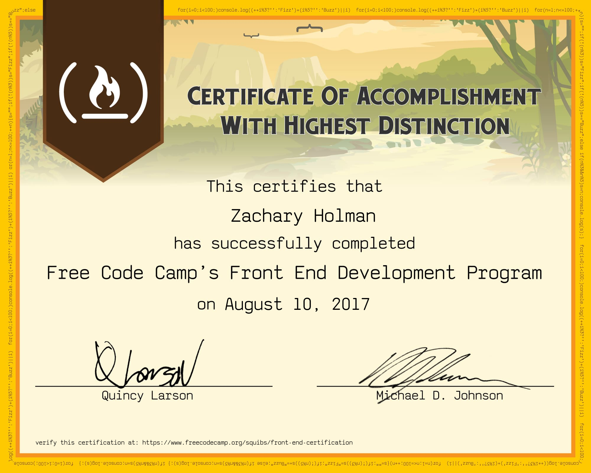
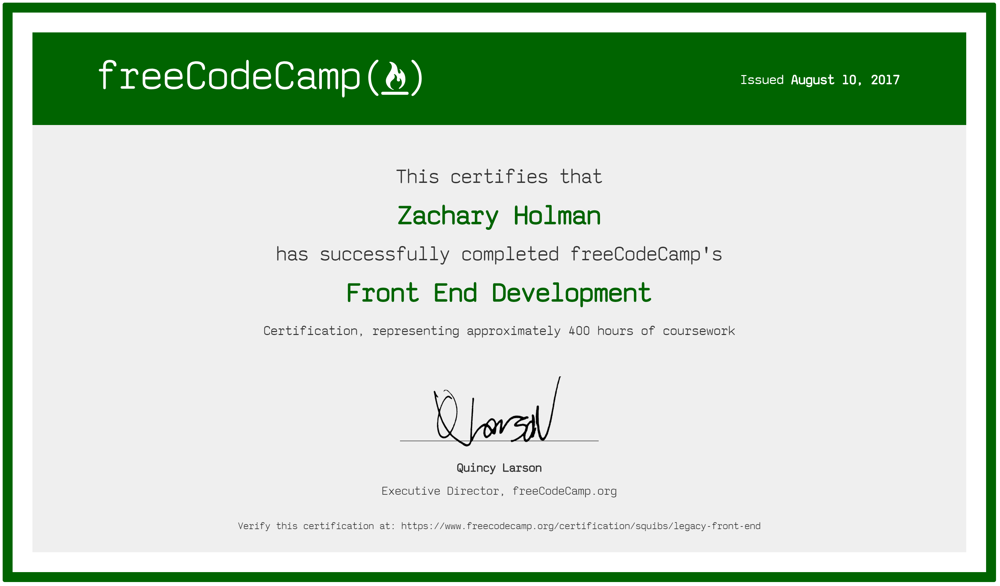
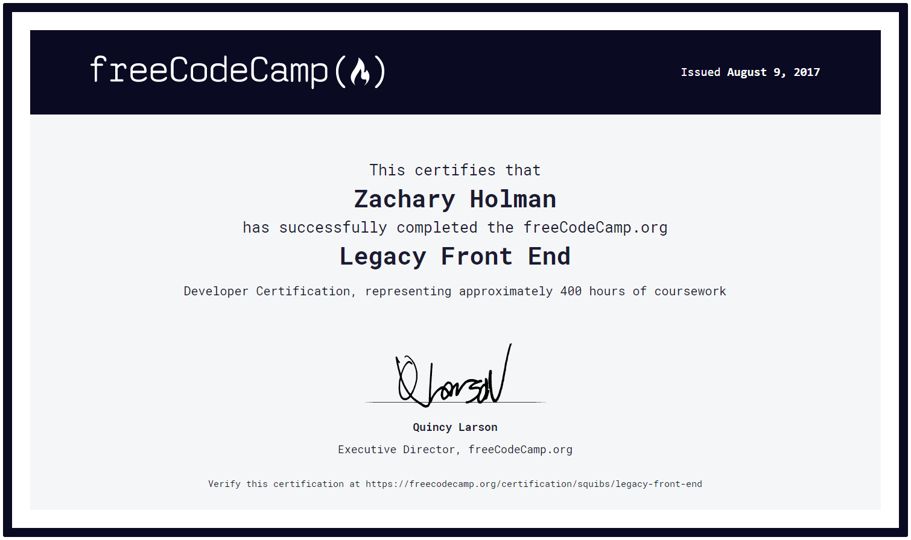
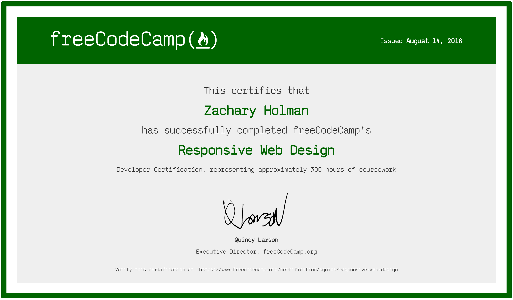
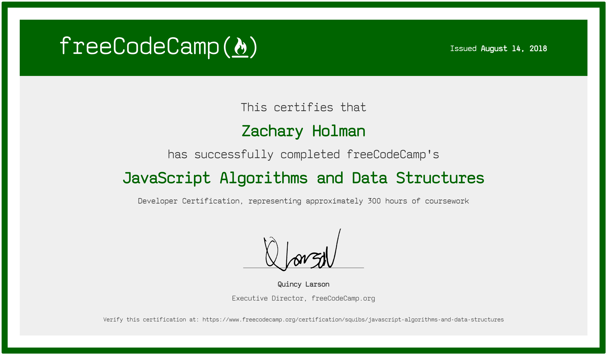
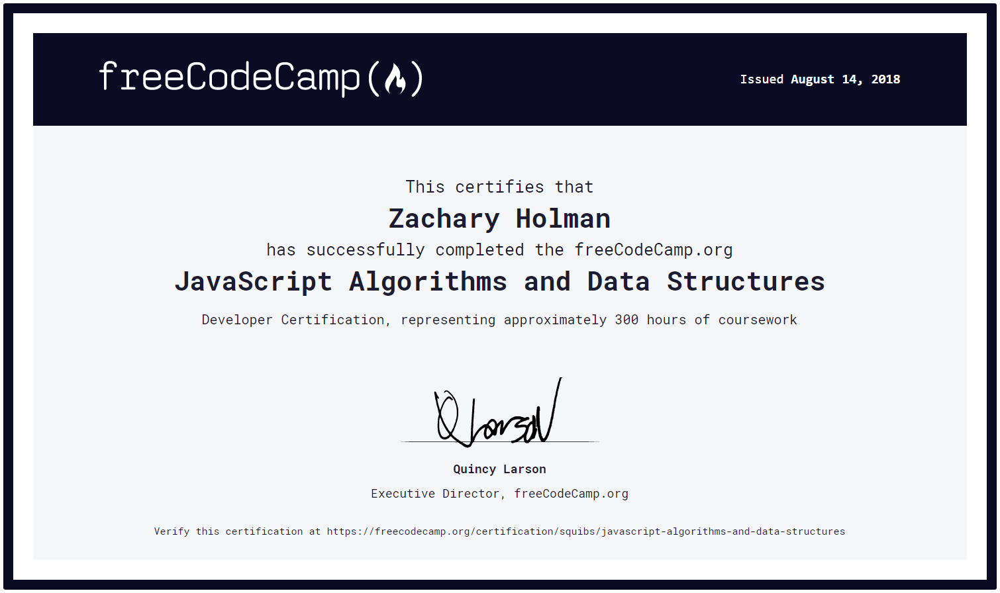
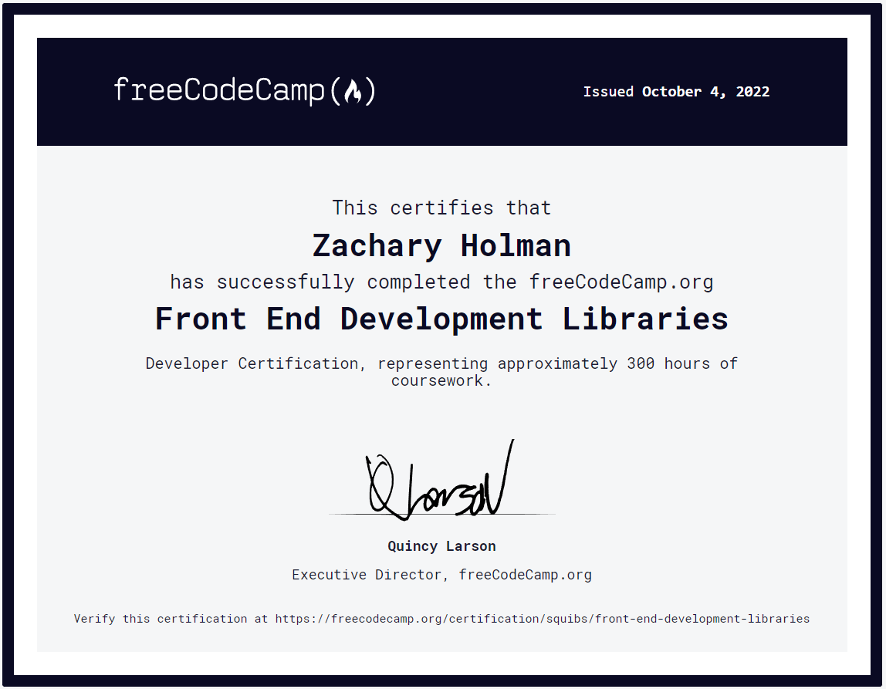
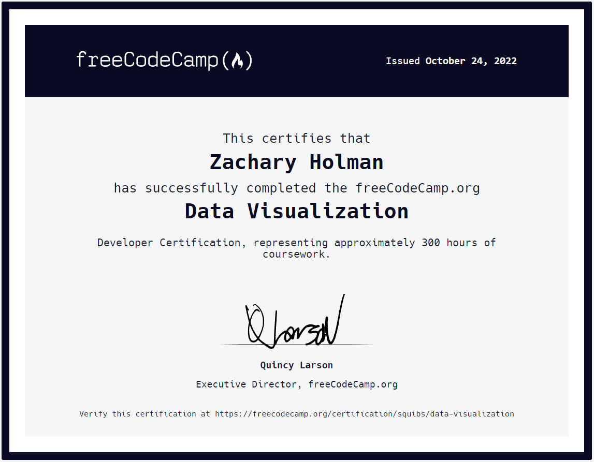
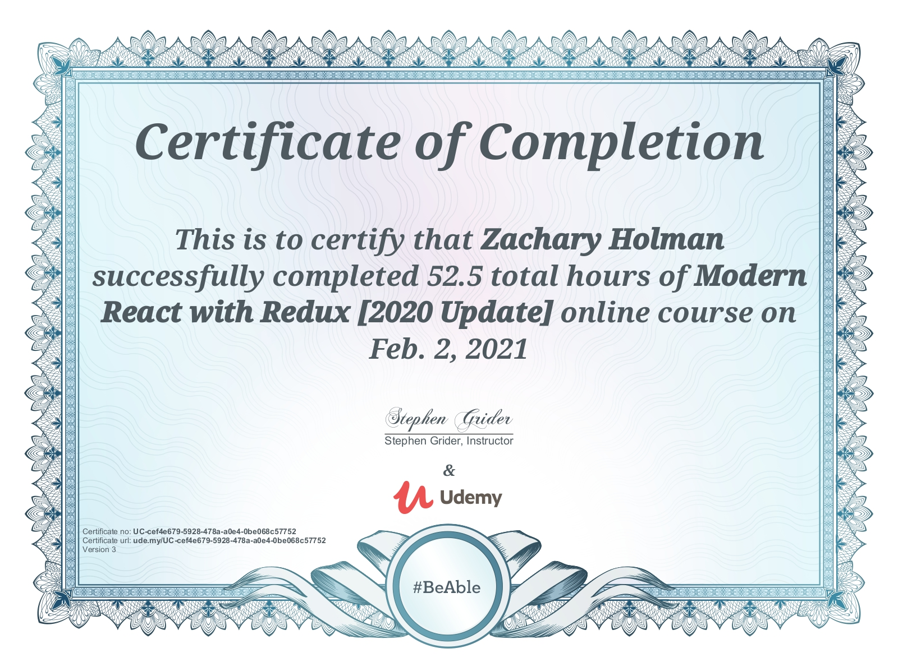

# Certificates

This is a collection of the various certificates I have received while going through the lessons / challenges from freeCodeCamp; as well as other places when I needed additional teaching.

Many of these are just updated certificates, which mainly consists of an updated color theme.

## freeCodeCamp Legacy Front End Development Certification

<table>
  <tr>
    <th>Legacy Certificate</th>
    <th>Updated Legacy Certificate</th>
    <th>Updated Legacy Certificate Again</th>
  </tr>
  <tr>
    <td></td>
    <td></td>
    <td></td>
  </tr>
</table>

[View This Certificate](https://www.freecodecamp.org/certification/squibs/legacy-front-end)

## freeCodeCamp Responsive Web Design Certification

<table>
  <tr>
    <th>Certificate</th>
    <th>Updated Certificate</th>
  </tr>
  <tr>
    <td></td>
    <td></td>
  </tr>
</table>

[View This Certificate](https://www.freecodecamp.org/certification/squibs/responsive-web-design)

[Read My Thoughts on Receiving this Certificate](/1.%20Responsive%20Web%20Design/Legacy%20Responsive%20Web%20Design/9.%20Claim%20Your%20Responsive%20Web%20Design%20Certificate.md#claim-your-responsive-web-design-certificate)

## freeCodeCamp JavaScript Algorithms and Data Structures Certification

<table>
  <tr>
    <th>Certificate</th>
    <th>Updated Certificate</th>
  </tr>
  <tr>
    <td></td>
    <td></td>
  </tr>
</table>

[View This Certificate](https://www.freecodecamp.org/certification/squibs/javascript-algorithms-and-data-structures)

## freeCodeCamp Front End Development Libraries Certification

[View This Certificate](https://www.freecodecamp.org/certification/squibs/front-end-development-libraries)

## freeCodeCamp Data Visualization Certification

[View This Certificate](https://www.freecodecamp.org/certification/squibs/data-visualization)

## Udemy - Modern React with Redux by Stephen Grider - Certification

[View This Certificate](https://www.udemy.com/certificate/UC-cef4e679-5928-478a-a0e4-0be068c57752/)  
[Link to my repository for this course](https://github.com/Squibs/modern-react-redux)
