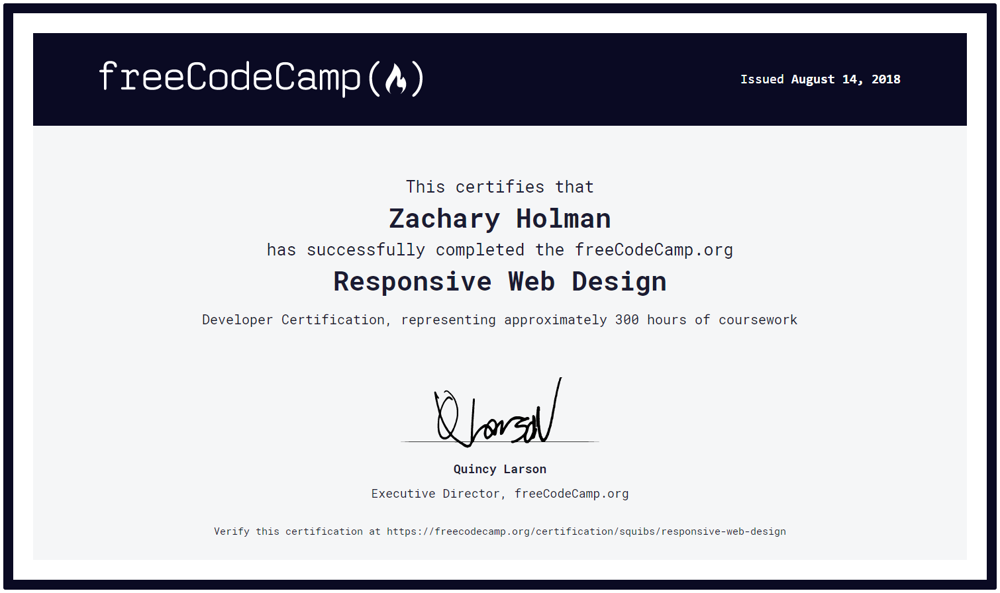

# Certificates

This is a collection of the various certificates I have received while going through the lessons / challenges from freeCodeCamp; as well as other places when I needed additional teaching.

Many of these are just updated certificates, which mainly consists of an updated color theme.

## freeCodeCamp Legacy Front End Development Certification

<table>
  <tr>
    <th>Legacy Certificate</th>
    <th>Updated Legacy Certificate</th>
    <th>Updated Legacy Certificate Again</th>
  </tr>
  <tr>
    <td></td>
    <td></td>
    <td></td>
  </tr>
</table>

## freeCodeCamp Responsive Web Design Certification

<table>
  <tr>
    <th>Certificate</th>
    <th>Updated Certificate</th>
  </tr>
  <tr>
    <td></td>
    <td></td>
  </tr>
</table>

## freeCodeCamp JavaScript Algorithms and Data Structures Certification

<table>
  <tr>
    <th>Certificate</th>
    <th>Updated Certificate</th>
  </tr>
  <tr>
    <td></td>
    <td></td>
  </tr>
</table>

## Udemy - Modern React with Redux by Stephen Grider - Certification

