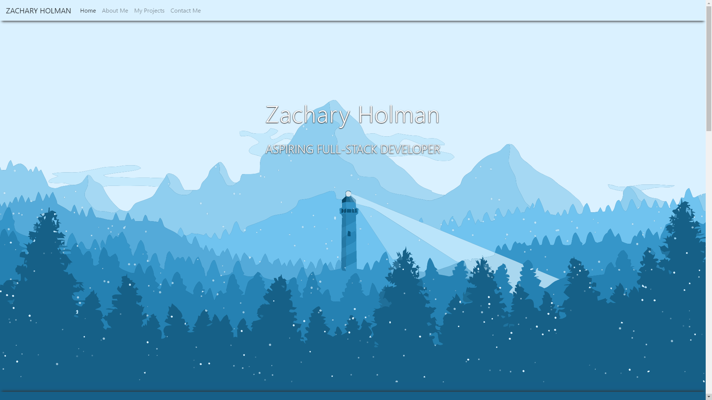
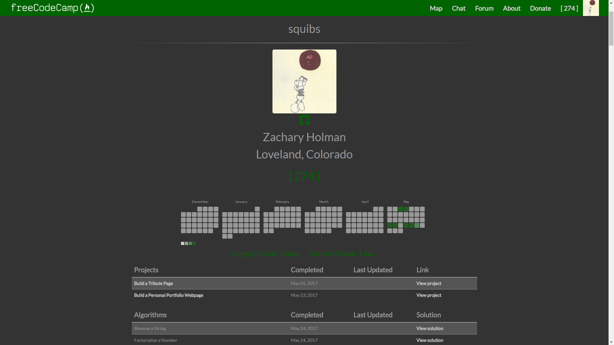

# freeCodeCamp

The lesson solutions and projects I have created while going through the coding lessons and project challenges at freeCodeCamp.org.

Click the links below to navigate through each section and view the solutions I came up with for challenges and my completed projects. If a section is ~~crossed out~~, I have not yet finished the section and will update this list when I complete it in the future.

- [Responsive Web Design](https://github.com/Squibs/Beta-freeCodeCamp/tree/master/Responsive%20Web%20Design#responsive-web-design)
- [Javascript Algorithms and Data Structures](https://github.com/Squibs/Beta-freeCodeCamp/tree/master/JavaScript%20Algorithms%20and%20Data%20Structures#javascript-algorithms-and-data-structures)
- [Front End Libraries](https://github.com/Squibs/Beta-freeCodeCamp/tree/master/Front%20End%20Libraries#front-end-libraries)
- ~~Data Visualization~~
- ~~APIs and Microservices~~
- ~~Information Security and Quality Assurance~~
- ~~Contribute to Open Source and Help Nonprofits~~
- ~~Coding Interview Prep and freeCodeCamp Legacy Projects~~

## A few quick links

- [My Portfolio](https://github.com/Squibs/Squibs.github.io) (Created as one of the first few project challenges for freeCodeCamp)

- [My freeCodeCamp Profile]()

