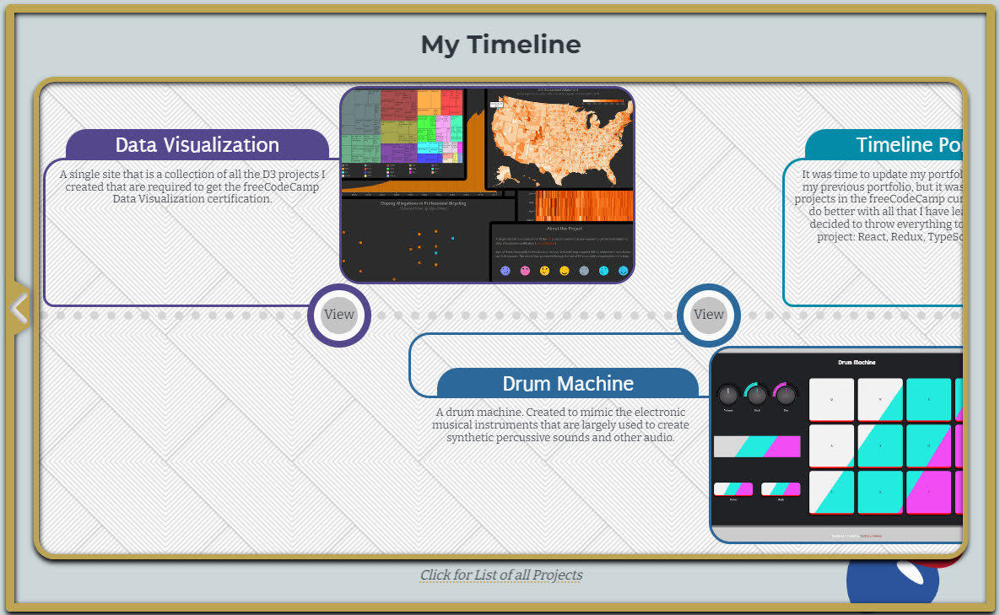
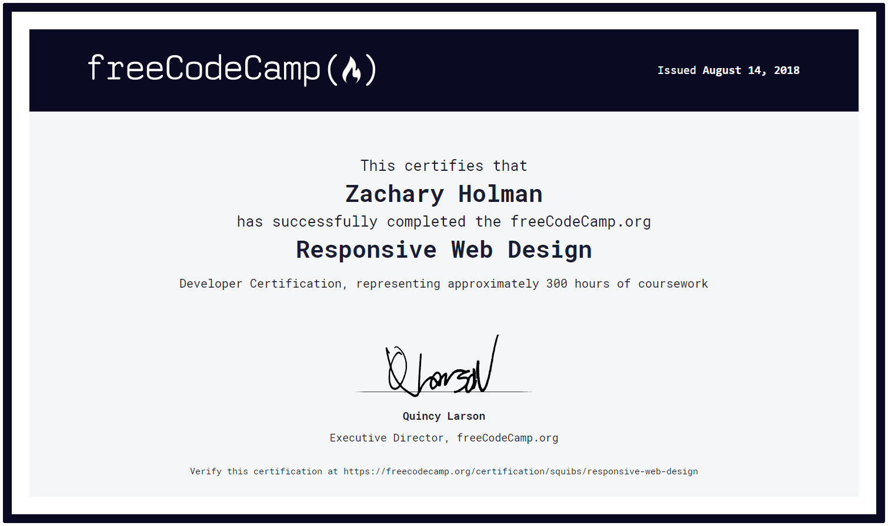

# freeCodeCamp

The lesson solutions and projects I have created while going through the coding lessons and project challenges at freeCodeCamp.org.

I used to have two separate repositories dedicated to freeCodeCamp, one for the beta site and one for the original/legacy lessons. freeCodeCamp has since released the beta lessons to the main site, and I have now merged my two repositories into this one.

Click the links below to navigate through each section and view the solutions I came up with for challenges and my completed projects. If a section is ~~crossed out~~, I have not yet finished the section and will update this list when I complete it in the future.

- ✔️ [Responsive Web Design](./Responsive%20Web%20Design/README.md#responsive-web-design)
- ✔️ [JavaScript Algorithms and Data Structures](./JavaScript%20Algorithms%20and%20Data%20Structures/README.md#javascript-algorithms-and-data-structures)
- ✔️ [Front End Development Libraries](./Front%20End%20Development%20Libraries/README.md#front-end-libraries)
- ✔️ [Data Visualization](./Data%20Visualization/README.md#data-visualization)
- ✔️ [Relational Database](./Relational%20Database/README.md#relational-database)
- 🚧 [Back End Development and APIs](./Back%20End%20Development%20and%20APIs/README.md#back-end-development-and-apis)
- ❌ ~~Quality Assurance~~
- ❌ ~~Scientific Computing with Python~~
- ❌ ~~Data Analysis with Python~~
- 🚧 [Information Security](./Information%20Security/README.md#information-security)
- ❌ ~~Machine Learning with Python~~
- 🚧 [Coding Interview Prep](./Coding%20Interview%20Prep/README.md#coding-interview-prep)

## A few quick links

### [My Portfolio](https://zachary-holman.netlify.app/) (New and Improved)

[(older portfolio)](https://github.com/Squibs/Squibs.github.io#my-portfolio) (Created as one of the first few project challenges for freeCodeCamp)

### [freeCodeCamp Profile](https://www.freecodecamp.org/squibs)

### [Certificates](./Images/certificates#certificates) (Various Certificates I Have Received from freeCodeCamp and Elsewhere)

### [JavaScript References](./JavaScript%20References.md#javascript-references) (A reference page I created to consolidate JavaScript information in one place.)

### [Challenge Checklist](./Challenge%20Checklist.md#freecodecamp-challenge-checklist) (My own freeCodeCamp challenge checklist)
