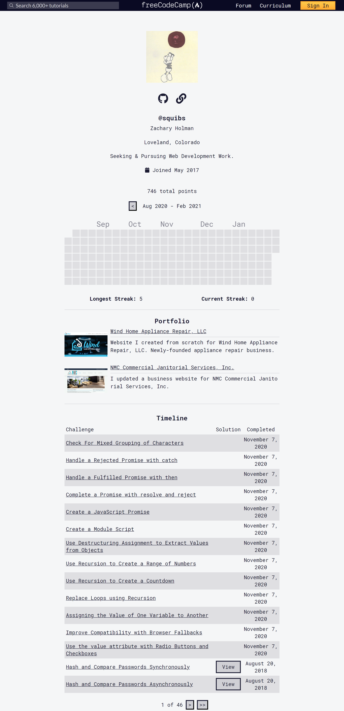

# freeCodeCamp

The lesson solutions and projects I have created while going through the coding lessons and project challenges at freeCodeCamp.org.

I used to have two separate repositories dedicated to freeCodeCamp, one for the beta site and one for the original/legacy lessons. freeCodeCamp has since released the beta lessons to the main site, and I have now merged my two repositories into this one.

Click the links below to navigate through each section and view the solutions I came up with for challenges and my completed projects. If a section is ~~crossed out~~, I have not yet finished the section and will update this list when I complete it in the future.

- [Responsive Web Design](./1.%20Responsive%20Web%20Design#responsive-web-design)
- [JavaScript Algorithms and Data Structures](./2.%20JavaScript%20Algorithms%20and%20Data%20Structures#javascript-algorithms-and-data-structures)
- [Front End Libraries](./3.%20Front%20End%20Libraries#front-end-libraries)
- [Data Visualization](./4.%20Data%20Visualization#data-visualization)
- [APIs and Microservices](./5.%20APIs%20and%20Microservices#apis-and-microservices)
- [Information Security and Quality Assurance](./6.%20Information%20Securty%20and%20Quality%20Assurance#information-security-and-quality-assurance)
- [Coding Interview Prep and freeCodeCamp Legacy Projects](./7.%20Coding%20Interview%20Prep%20and%20freeCodeCamp%20Legacy%20Projects#coding-interview-prep-and-freecodecamp-legacy-projects)

## A few quick links

- [My Portfolio](https://github.com/Squibs/Squibs.github.io#my-portfolio) (Created as one of the first few project challenges for freeCodeCamp)

- [freeCodeCamp Profile](https://www.freecodecamp.org/squibs)

- [Certificates](./Images/certificates#certificates) (Various Certificates I Have Received from freeCodeCamp and Elsewhere)

- [JavaScript References](./JavaScript%20References.md#javascript-references) (A reference page I created to consolidate JavaScript information in one place.)

- [Challenge Checklist](./Challenge%20Checklist.md#freecodecamp-challenge-checklist) (My own freeCodeCamp challenge checklist)
